Colorectal Cancer Analysis
================
Shashank Sharma
19/08/2020

This document explains the insights derived from analysing the dataset describing the cases diagnosed with Colorectal Cancer from 2008 to 2017. The analysis is divided into three sections based on:

-   Colorectal Cancer case counts
-   Mortality rate
-   Survival time

Each section is further sub-divided based on multiple parameters to get a deeper understanding of the trends in the dataset.

1. Colorectal Cancer Case Counts
--------------------------------

The plot below visualises the number of Colorectal Cancer cases diagnosed over time.

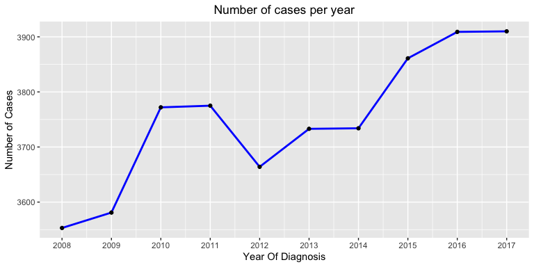

With exception of the year 2012, the general trend is that the number of Colorectal Cancer cases increased with time, but the rate with which the cases increased was not constant. The following trends were observed in the percentage increase/decrease of colorectal cancer cases over time:

-   The highest percentage increase was observed in the year 2010 with a 5.3% increase in cases.
-   The case count decreased by 2.9% in the year 2012.
-   The rate of increase in cases declined from 2015 to 2017.

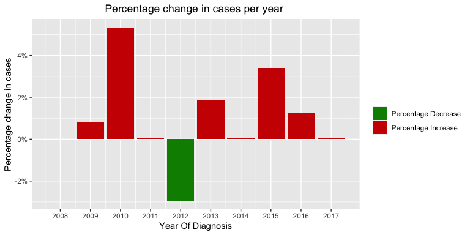

### 1.1 Cases distinguished by Sex

Throughout the span of 10 years, the number of male patients diagnosed with Colorectal Cancer was greater than female patients.

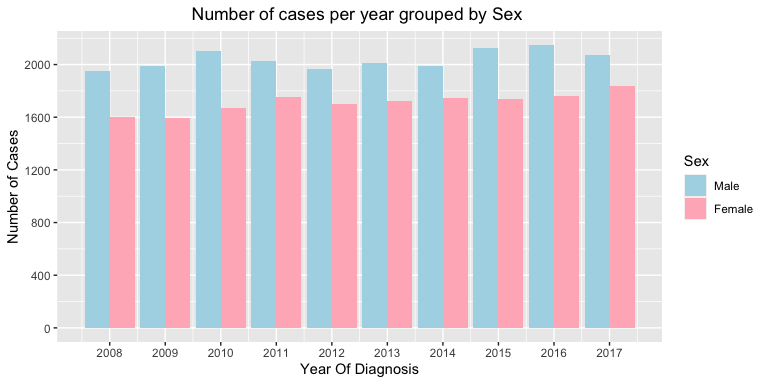

The percentage difference between male and female cases over time never went below 11.9% from 2008 to 2017. The highest difference was recorded in the year 2010 with a percentage difference of 23.2% and the lowest difference was recorded in 2017 with a percentage difference of 11.9%.

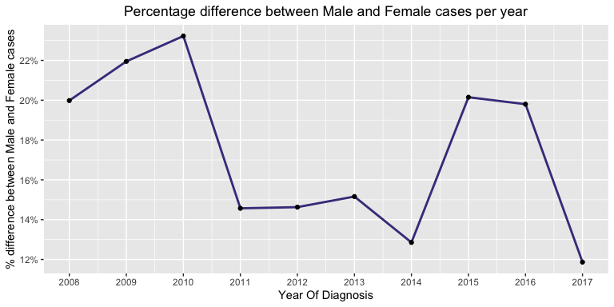

### 1.2 Cases distinguished by Age-Group

The total number of Colorectal Cancer cancer cases increases at a rapid rate from the age of 5 to 74. Henceforth, there is a sudden drop in cases by a difference of 495 between the age group of 80-84 and 75-79. Thereafter, the number of cases gradually decreases for ages above 85.

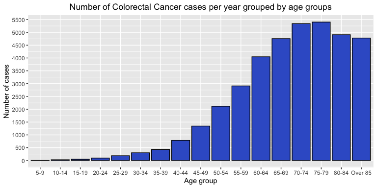

### 1.3 Cases distinguished by Sex and Age-group

The number of male and female cases over time varied vividly for different age groups, the observed trends are as follows:

-   Case count for both the genders is uniform from the age group of 5 to 49.
-   The number of male cases surpasses female cases over time from the age of 50 to 79. The difference in the cases between the two genders rapidly increases till the age of 69. Thereafter, the difference gradually decreased from the age group of 70 to 79.
-   Again, the age group from 80-84 exhibited a uniform trend in the number of male and female cases over time.
-   Strikingly, female cases dominantly surpass male cases over time for people above the age of 85.

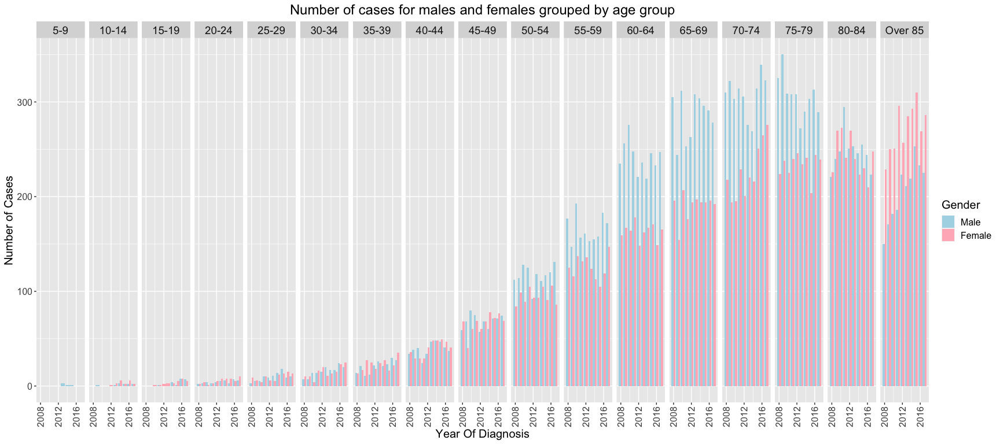

### 1.4 Cases distinguished by ICD-10 Sites

Throughout the span of 10 years, there is a very strong trend in the number of cases across C18, C19 and C20 sites.

-   The number of patients with cancer at site C-18 was more than 2.5 times as compared to site C20.
-   The number of patients with cancer at site C-20 was more than 4 times as compared to site C19.

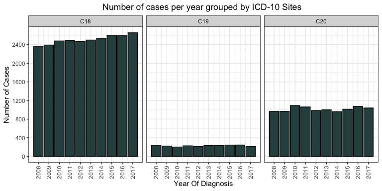

### 1.5 Cases distinguished by ICD-10 Sites and Sex

The number of male and female cases were almost uniform for cancer site C18 and C19. But, there was a noticeable difference in the count of cases for site C20, the number of cases in males was 1.7 times more than females in the span of 10 years.

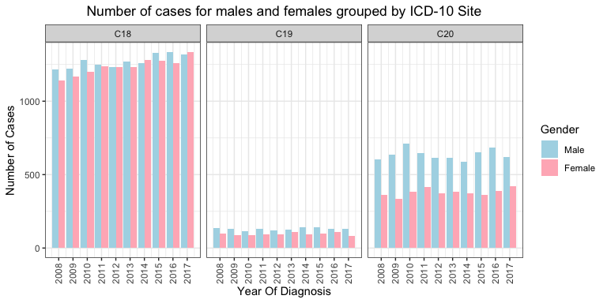

### 1.6 Cases distinguished by ICD-10 Morphology

The distribution of Colorectal Cancer cases across different morphology codes is very non-uniform. Morphology code 8140 has a total of 26652 cases in 10 years, which extremely high as compared to all other morphologies. To quantify the extremity, the case count of morphology code 8140 is 8.7 times greater than the second highest morphology code with 8480 cases. There are a few other morphology codes(800, 8263,8210) with their total case count ranging between 2500 and 1500. The remaining morphology codes have extremely low case count as compared to the aforementioned morphology codes.

A thorough analysis of some morphology codes is performed in section 2.5 of this report.

### 1.7 Cases distinguished by Cancer Stage

The following trends were observed in then case count of cancer stages over time:

-   Case count for Stage one increased from year 2015 to 2017.
-   Case count for Stage two and stage three cancer remained almost uniform throughout the span of 10 years.
-   Case count for stage four increase between the year 2010 and 2015 as compared to toher years.

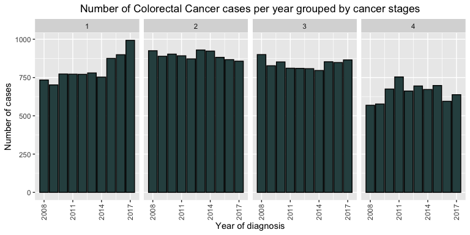

2. Mortality Rate
-----------------

The mortality rate of all types of Colorectal Cancers combined is 38.43%. The mortality rate is analysed on multiple factors in subsequent sub-sections.

### 2.1 Mortality rate per ICD-10 Site

This section explores the trend in mortality rate with respect to ICD-10 Site. The following trends were observed in the data:

-   C18 and C19 have an almost equal mortality rate of about 40%.
-   C20 has mortality rate of 33.7%.

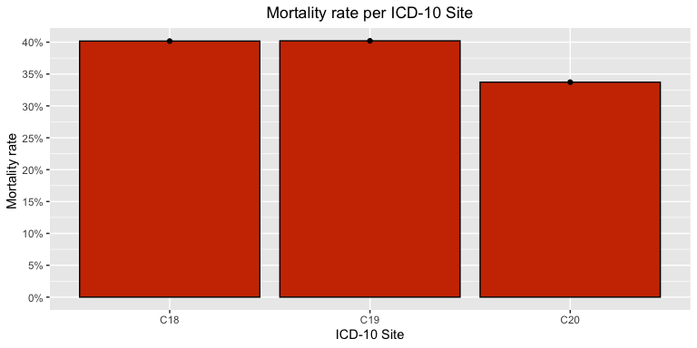

### 2.2 Mortality rate per Age

This section explores the trend in mortality rate with respect to age groups. The following trends were observed in the data:

-   The mortality rate is less than 10% for ages less than 24.
-   The mortality rate for the age range of 25 to 69 lies between 19% and 30%.
-   For ages above 70, the mortality rate increases rapidly.

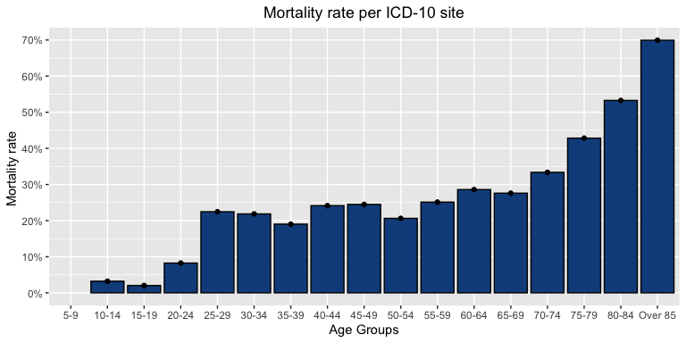

### 2.3 Mortality rate per Cancer Stage

This section explores the trend in the increase of mortality rate with respect to cancer stages. The following trends were observed in the data:

-   Mortality rate increase linearly from stage 1 to stage 3 cancer.
-   Mortality rate of stage 4 cancer is 2.3 times more than stage 3 Cancer.

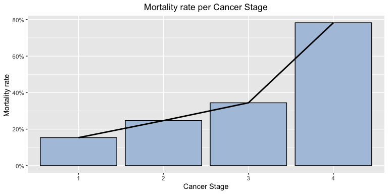

### 2.4 Mortality rate per ICD-10 Site and Cancer Stage

It was observed that stage 4 cancer had different ICD-10 site distribution as compared to the other three stages. The difference between ICD-site distribtion is as follows:

-   For Cancer stages 1,2 and 3, the mortality rate is highest for site C18, followed by C20 and least for C19.
-   Stage 4 exhibits a different trend with the highest mortality rate for C19, closely followed by C18 and least for C20.

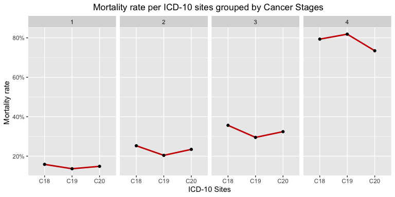

### 2.5 Mortality rate per ICD-10 Morphology

As observed in section 1.6, the count of cases for different morphology codes varies greatly. As a very small sample size can decrease statistical power, only morphology codes with a total number of cases more than or equal to 25 are considered for calculating the mortality rate. The observations from the plot obtained for mortality rate for remaining morphology codes are as follows:

-   Morphology codes 8000,8010,8020 and 8041 have a very high mortality rate.
-   Morphology codes 8240,8243 and 8249 exhibit an extremely low mortality rate.
-   Morphology code 8140 with an unusually high number of cases exhibits mortality rate of 36.5%.

Further analysis is done for all the morphology codes highlighted in this section to get a deeper understanding of their behaviour.

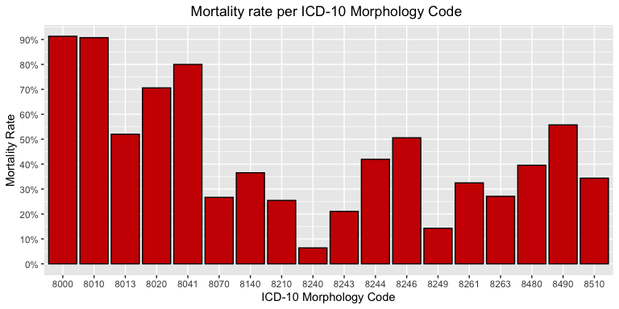

#### 2.5.1 High Mortality Morphology Types

The section analyses the morphology types 8000, 8010, 8020 and 8041 to find out the reason behind their high mortality. Plotting these morphology codes with respect to Cancer stages showed that these codes have a relatively high number of stage 4 cases, which is a clear indication of high mortality.

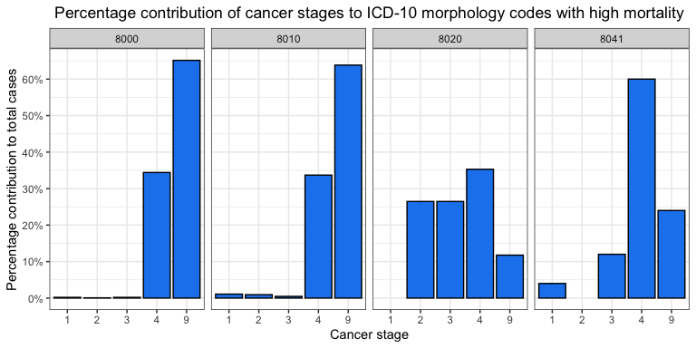

Another reason for high mortality for these morphology codes is the age group of the patients who are diagnosed with it. Morphology codes 8000, 8010 and 8020 have a high proportion of patients belonging to older age groups due to which their mortality is high.

Morphology code 8041 shows uniform distribution for age group, but a very high proportion of stage 4 cases overpowers the age factor and leads to a high mortality rate.

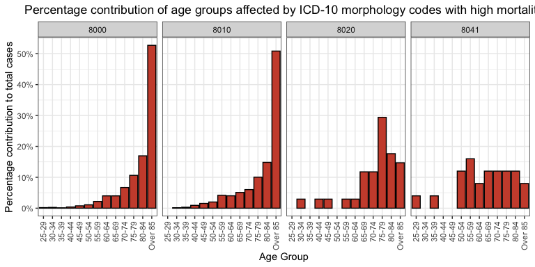

#### 2.5.2 Low Mortality Morphology Types

The section analyses the morphology types 8240, 8243 and 8249 to find out the reason behind their low mortality. The following trends were observed by analysing the percentage contribution of cancer stages to total cases for each morphology code:

-   Morphology code 8240 had the highest case count for first stage cancer and comparatively low for all the other stages.
-   Morphology code 8243 had approximately uniform distribution amongst all 4 stages.
-   Morphology code 8249's stage distribution showed no clear reason for the low mortality rate.
-   One factor that was common for all three morphology codes was that there were many missing values for cancer stages.

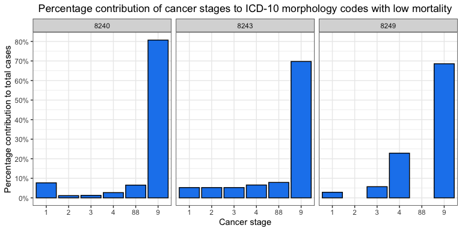

The age distribution of people affected by Morphology code 8240 and 8243 gives a clear indication of the possibility of a low mortality rate as the majority of the cases belong to 10-69 age group. Morphology code 8249 had comparatively high proportion of cases for ages range of 70 to 79 but it falls rapidly for ages above 80.

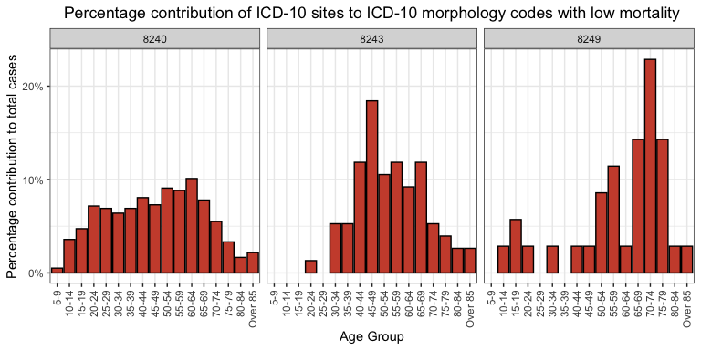

#### 2.5.3 Morphology Code 8140

The distribution of cases for morphology code 8140 based on cancer stages is significant because considering an extremely high number of total cases, the number of missing values is very low. Morphology code 8140 has a mortality rate of 36.5% as more than 50% of patients diagnosed with morphology 8140 are in the second or third stage of cancer whereas only 18% cases for stage 4. Therefore, despite extremely high number of cases morphology code 8140 is not amongst the morphology codes with a high mortality rate.

3. Survival Months
------------------

In this section, the impact of different parameters on the survival months of dead patients is observed by measuring the central tendency of survival months with respect to those parameters. As the distribution of case count for survival months is highly skewed due to a high number of cases with short survival times, the central tendency is calculated using the median rather than mean.

This analysis is not done for alive patients as no clear indication is present in data if they were cured or not. If a patient is cured his survival months should be counted till the date they were declared healthy. This would help in obtaining a good idea of time taken to defeat cancer.

### 3.1 Survival months distinguished by Cancer Stage

-   The median survival time for stage three is 3 times more than stage four.
-   Median survival time in increase linearly (approximately) from stage three to stage one.

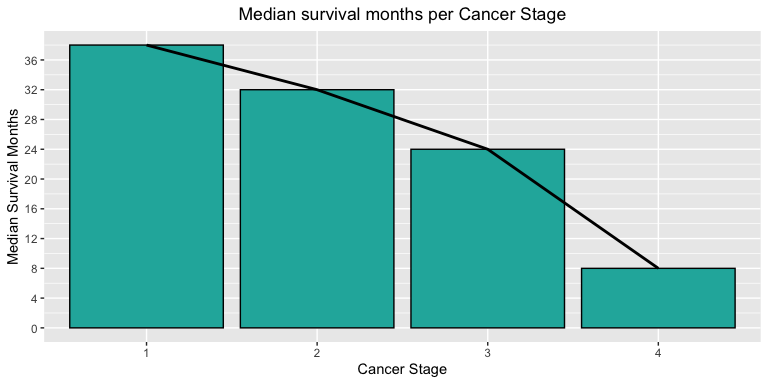

### 3.2 Survival months distinguished by Age Groups

-   High median survival times are observed for the age group of 45 to 64.
-   Median survival time decreases gradually on either side of the 45-64 age group.
-   The lowest median survival time is recorded for the age group of over 85.
-   Exceptionally high survival time for the age group of 10-14 and 15-19 should be neglected as there is only 1 case each in these age groups, hence calculating central tendency loses its meaning.
-   The highest survival time is observed age-group 20-24. But, as there are only 8 cases in this group, the observation could not be considered as significant.

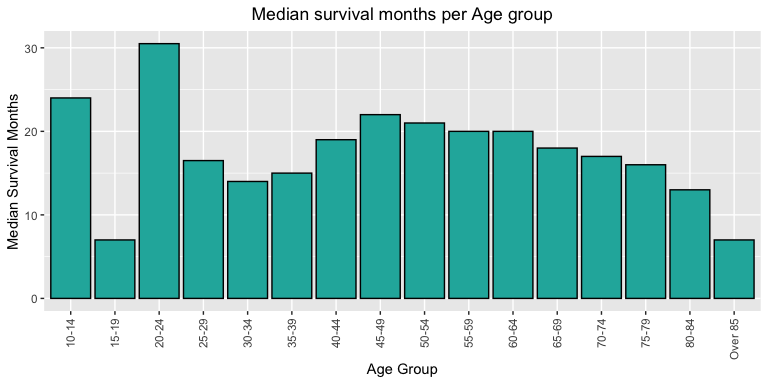

### 3.3 Survival months distinguished by ICD-10 Sites and Cancer Stage

-   A similar trend is observed for stage two and stage three cancer with survival months increasing from C18 to C20.
-   Stage one cancer exhibits exactly inverse relation with median survival times with respect to cancer stages as compared to Stage four cancer.

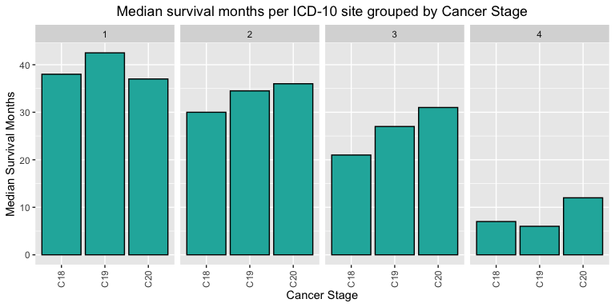
